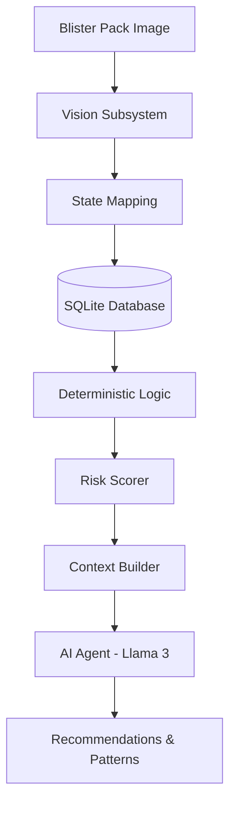

# MedCheck: Medication Adherence System

GuardianFoil is an AI-powered medication monitoring platform that uses Computer Vision and Large Language Models (LLMs) to ensure patients adhere to their prescribed medication schedules. By analyzing images of blister packs, the system identifies missed doses, late takes, and dangerous patterns like double dosing.

---

## 🏗️ System Architecture

The system follows a modular pipeline where data flows from raw image capture to high-level AI interpretation.



---

## 📚 Library Dependencies

The project relies on several key libraries to handle vision, data, and AI communication:

| Library | Role | Why it is used |
| :--- | :--- | :--- |
| **`ultralytics`** | Computer Vision | Provides the YOLOv8 engine for detecting pill cavities and classifying them as "intact" or "broken". |
| **`sqlite3`** | Data Persistence | A lightweight, file-based database used to store medication schedules, scan history, and derived adherence events. |
| **`requests`** | AI Communication | Used to send prompts to the locally hosted Ollama server (running Llama 3). |
| **`json`** | Data Formatting | Ensures consistent communication between the deterministic logic and the AI agent. |
| **`uuid`** | Identity Management | Generates unique IDs for each medication pack to prevent collisions. |
| **`datetime`** | Temporal Logic | Essential for comparing actual scan times against the prescribed `dose_schedule`. |

---

## 🧩 Component Breakdown

### 1. Vision Subsystem (`yolo_inference.py`, `mapping.py`)
*   **Input**: JPEG/PNG image of a blister pack.
*   **Process**: Runs YOLOv8 inference using the model at `yolo_wei/blister_detection_best.pt`.
*   **Output**: A list of detections with labels (`intact` or `broken`) and confidence scores.
*   **Mapping**: Converts YOLO labels to system states (`intact`, `empty`).

### 2. Database Layer (`db_setup.py`, `medcheck.db`)
Stores the ground truth for every medication pack:
*   `packs`: High-level pack information.
*   `dose_schedule`: Expected timings for each cavity.
*   `scan_sessions`: Metadata for every time a photo is processed.
*   `cavity_snapshots`: The state of each specific pill at a specific time.
*   `decision_events`: Logic-derived events (e.g., "Missed Dose at 8:00 AM").

### 3. Analysis Logic (`risk_scorer.py`, `alert_engine.py`, `decision_test.py`)
*   **Calculations**: Computes a **Risk Score (0–10)**.
*   **Logic**:
    *   **Severity**: Weights events (e.g., $Missed > Late$).
    *   **Frequency**: Tracks how often issues occur.
    *   **Patterns**: Penalizes repeated bad behaviors (like consecutive double doses).
*   **Alerting**: Generates deterministic warnings for immediate risks.

### 4. AI Agent (`agent.py`, `memory.py`)
*   **Role**: The "Interpreter".
*   **Process**:
    1.  `memory.py` fetches the last 7 days of history.
    2.  The context builder formats history and current risk into a structured prompt.
    3.  **Llama 3** processes the data to explain *why* the score is high and what the patient should do.
*   **Output**: A JSON object containing `thought`, `pattern`, `insight`, and `recommendation`.

---

## 🔄 Workflow & Data Flow

### Step 1: Registration
1.  Run `register_and_scan.py <image_path>`.
2.  The system creates a new `pack_id`.
3.  The image is treated as the **Baseline** (all pills should be intact).
4.  A default schedule is assigned.

### Step 2: Regular Scanning (Monitoring)
1.  Run `run_pipeline.py`.
2.  The current image is compared against the database history.
3.  New `decision_events` are recorded if the state changed from `intact` to `empty`.

### Step 3: AI Analysis
1.  Run `run_agent_test.py <pack_id>`.
2.  The Agent reviews the entire timeline and generates qualitative feedback.

---

## 🚀 How to Use

### 1. Setup Environment
Ensure you have the `tf_env` conda environment active:
```bash
conda activate tf_env
```

### 2. Register a New Pack
```bash
python register_and_scan.py s1.jpeg
```

### 3. Analyze a Pack with the Agent
```bash
python run_agent_test.py <PACK_ID>
```

### 4. Simulate History (Testing)
To test the agent's reasoning without new images:
```bash
python simulate_history.py <PACK_ID>
```

---

> [!TIP]
> **Monitoring Ollama**: Make sure the Ollama server is running locally on port `11434` with `llama3.1:8b` pulled before running the agent.
